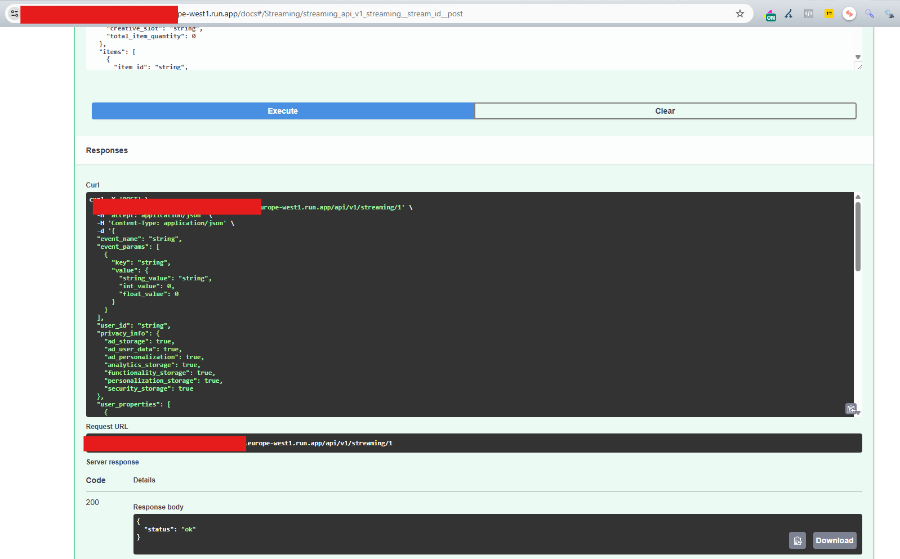
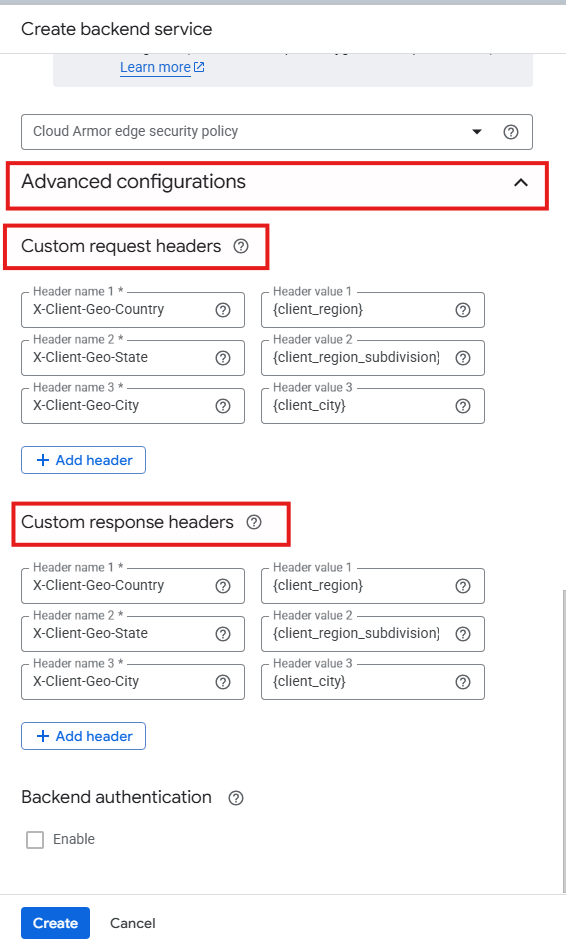
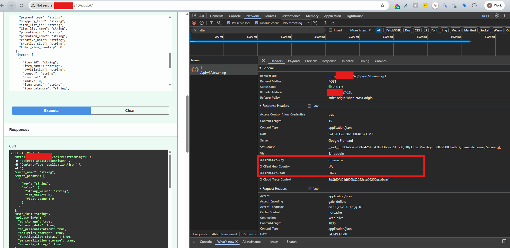

# Real Streaming

## Overview

**Real Streaming** is a high-performance FastAPI-based real-time event streaming service designed to collect, enrich, and stream web analytics events directly to Google BigQuery. The service acts as a server-side event collection endpoint that can be integrated with web applications via JavaScript, similar to Google Analytics 4 (GA4) Measurement Protocol.

### What This Service Does

This service provides:

1. **Real-time Event Collection**: Accepts analytics events from web browsers via HTTP POST requests
2. **Server-side Enrichment**: Automatically enriches events with:
   - Device information (parsed from User-Agent)
   - Geographic location (from headers or IP)
   - Traffic source attribution (UTM parameters, referrer analysis)
3. **High-Performance Streaming**: Streams data to BigQuery using two strategies:
   - **Direct Streaming**: Uses BigQuery Storage Write API for maximum throughput
   - **Pub/Sub**: Publishes events to Google Cloud Pub/Sub for asynchronous processing
4. **Production-Ready Features**:
   - Automatic table creation with partitioning and clustering
   - Request batching and buffering for optimal performance
   - CORS support for cross-origin requests
   - Brotli compression for efficient data transfer
   - Comprehensive logging (local and Google Cloud Logging)

### Key Capabilities

- ✅ **GA4-Compatible Schema**: Events follow Google Analytics 4 BigQuery export schema
- ✅ **Device Detection**: Accurate device, browser, and OS detection using Matomo Device Detector
- ✅ **Traffic Source Attribution**: Automatic parsing of UTM parameters and referrer analysis
- ✅ **Cookie-based User Tracking**: Cross-subdomain cookie support (like Google Analytics)
- ✅ **Protobuf Serialization**: Efficient binary serialization for BigQuery Storage Write API
- ✅ **Auto-scaling**: Designed for Google Cloud Run with horizontal scaling
- ✅ **Error Handling**: Graceful error handling with retry logic and dead-letter queue support

---

## Quick Start

Choose your deployment option:

- 🚀 **[Run Locally](#local-development)** - Quick setup for local development and testing
- ☁️ **[Deploy to Cloud Run](#production-deployment-google-cloud-run)** - Production deployment on Google Cloud Run

> **Recommended**: Start with local development to test the application, then proceed to cloud deployment.

---

## Required Google Cloud Services

For production deployment, you need to enable and configure the following Google Cloud services:

### Required Services

- **VPC Network** - For reserving static IP addresses
  - Used for: Load Balancer frontend IP address
  - Service: [VPC Network](https://console.cloud.google.com/networking/vpc)

- **Cloud Load Balancer** - For routing traffic and collecting client IP/geolocation
  - Used for: HTTP(S) load balancing, adding client IP headers (`X-Forwarded-For`, `X-Client-Geo-*`)
  - Service: [Load Balancing](https://console.cloud.google.com/net-services/loadbalancing)
  - **Note**: Required if you want to collect IP addresses and geolocation data

- **Cloud Artifact Registry** - For storing Docker container images
  - Used for: Storing Docker images built by Cloud Build
  - Service: [Artifact Registry](https://console.cloud.google.com/artifacts)

- **Cloud Build** - For building and deploying the application
  - Used for: Building Docker images, pushing to Artifact Registry, deploying to Cloud Run
  - Service: [Cloud Build](https://console.cloud.google.com/cloud-build)

- **Cloud Run** - For running the application
  - Used for: Hosting the FastAPI application
  - Service: [Cloud Run](https://console.cloud.google.com/run)

- **BigQuery** - For storing analytics events
  - Used for: Storing streamed events data
  - Service: [BigQuery](https://console.cloud.google.com/bigquery)

### Optional Services

- **Cloud Pub/Sub** - For asynchronous event processing (if using Pub/Sub strategy)
  - Used for: Publishing events to Pub/Sub topics, then writing to BigQuery via subscription
  - Service: [Pub/Sub](https://console.cloud.google.com/cloudpubsub)
  - **Note**: Only required if `APP_CONFIG__WRITERS__STRATEGY=pubsub`


## Architecture

### High-Level Flow

```
                                        ┌───────────────────┐
                                        │     Web Browser   │
                                        └────────┬──────────┘
                                                 │
                                                 ▼
                                        ┌───────────────────┐
                                        │   Load Balancer   │
                                        │  (adds headers)   │
                                        └────────┬──────────┘
                                                 │
                                                 ▼
                                        ┌───────────────────┐
                                        │  FastAPI Endpoint │
                                        └────────┬──────────┘
                                                 │
                                 ┌───────────────┼────────────────┐
                                 │               │                │
                                 ▼               ▼                ▼
                        ┌────────────────┐ ┌────────────────┐ ┌────────────────┐
                        │   Cookie Mgmt  │ │ Device Parsing │ │  Geo Detection │
                        └────────────────┘ └────────────────┘ └────────────────┘
                                                 │
                                                 ▼
                                        ┌───────────────────┐
                                        │ Request Enrichment│
                                        └────────┬──────────┘
                                                 │
                                 ┌───────────────┴───────────────┐
                                 │                               │
                                 ▼                               ▼
                        ┌───────────────────┐           ┌───────────────────┐
                        │     (Pub/Sub)     │           │ Direct to BigQuery│    
                        └────────┬──────────┘           └────────┬──────────┘
                                 │                               │
                                 └───────────────┬───────────────┘
                                                 ▼
                                        ┌───────────────────┐
                                        │     BigQuery      │
                                        └───────────────────┘
 
```

## Installation

### Prerequisites

- Python 3.10+ (tested with Python 3.14)
- Google Cloud Project with BigQuery API enabled
- Google Cloud CLI installed and configured
- Google Cloud Service Account with appropriate permissions (see [Permissions](#permissions))

### Local Development Setup

Follow these steps to set up and run the application locally:

#### Step 1: Clone Repository and Install Dependencies

1. **Clone the repository**:
```bash
git clone <repository-url>
cd real-streaming
```

2. **Create a virtual environment**:
```bash
python -m venv venv
# On Windows
venv\Scripts\activate
# On Linux/Mac
source venv/bin/activate
```

3. **Install dependencies**:
```bash
pip install --upgrade pip
pip install -r requirements.txt
```

#### Step 2: Configure Environment Variables

1. **Copy the template file**:
```bash
cp .env.template src/.env
```

2. **Edit `src/.env`** and set the following required variables:

```bash
# Required: Google Cloud Project ID
APP_CONFIG__WRITERS__PROJECT_ID=your_project_id

# Required: BigQuery Dataset ID
APP_CONFIG__WRITERS__BQ__DATASET_ID=your_dataset_id

# Required: BigQuery Table ID
APP_CONFIG__WRITERS__BQ__TABLE_ID=your_table_id

# Required: Streaming strategy (use "direct" for local development)
APP_CONFIG__WRITERS__STRATEGY=direct

# Required: CORS allowed origins (for local development)
APP_CONFIG__CORS__ALLOWED_ORIGINS=["https://127.0.0.1:8080","http://127.0.0.1:8080","http://localhost:8080"]
```

> **Note**: Replace `your_project_id`, `your_dataset_id`, and `your_table_id` with your actual Google Cloud project, dataset, and table names.

#### Step 3: Set Up Google Cloud Application Default Credentials

The application uses [Application Default Credentials (ADC)](https://cloud.google.com/docs/authentication/application-default-credentials) for authentication with Google Cloud services.

For local development, authenticate using gcloud CLI:
```bash
gcloud auth application-default login
```

This will automatically configure credentials that will be used by the application. No need to set `GOOGLE_APPLICATION_CREDENTIALS` environment variable.

### Cloud BigQuery Setup (Direct Strategy)

> **Note**: For local development, we use the **Direct Strategy** (`APP_CONFIG__WRITERS__STRATEGY=direct`), which streams events directly to BigQuery using the BigQuery Storage Write API. This is the simplest setup for local testing.

#### Step 4: Create BigQuery Dataset

Before running the application, you need to create a BigQuery dataset:

1. Go to [Google Cloud Console](https://console.cloud.google.com) → BigQuery → SQL Workspace
2. Click on your project name in the left sidebar
3. Click **"Create Dataset"**
4. Enter the dataset ID (must match `APP_CONFIG__WRITERS__BQ__DATASET_ID` from Step 2)
5. Configure dataset settings:
   - **Data location**: Select your preferred region (e.g., `us-central1`)
   - **Default table expiration**: Optional (leave empty for no expiration)
   - **Encryption**: Use Google-managed encryption key (default)
6. Click **"Create Dataset"**


> **Note**: The table will be automatically created by the application on first use. No manual table creation is required.

#### Step 5: Run the Application Locally

Start the application:
```bash
uvicorn src.main:main_app --host 0.0.0.0 --port 8080 --reload
```

The API will be available at:
- API Documentation: `http://localhost:8080/docs`
- Alternative docs: `http://localhost:8080/redoc`
- Streaming endpoint: `http://localhost:8080/api/v1/streaming/{stream_id}`

After starting the application, check the console output. You should see a message indicating that the table was created:


**Verify table creation in BigQuery:**

1. Go to [Google Cloud Console](https://console.cloud.google.com) → BigQuery → SQL Workspace
2. Navigate to your dataset (created in Step 4)
3. Verify that the table (specified in `APP_CONFIG__WRITERS__BQ__TABLE_ID`) was automatically created
4. Click on the table name to view its details

#### Step 6: Send a Test Request via API Documentation

1. Open `http://localhost:8080/docs` in your browser
2. Find the `POST /api/v1/streaming/{stream_id}` endpoint
3. Click **"Try it out"**
4. Set `stream_id` to `1` (or any number)
5. Fill in the request body using the schema shown in Swagger UI (the request body structure is displayed in the documentation)
6. Click **"Execute"**


#### Step 7: Verify Data in BigQuery

1. Go to [Google Cloud Console](https://console.cloud.google.com) → BigQuery → SQL Workspace
2. Navigate to your dataset and table
3. Click on the table name
4. Click **"Preview"** tab to view the data
5. Or run a SQL query:
```sql
SELECT * FROM `your_project_id.your_dataset_id.your_table_id`
ORDER BY event_timestamp DESC
LIMIT 10;
```

You should see your test event data in the table:


---

### Next Steps: Google Cloud Pub/Sub Setup

If you want to use the **Pub/Sub strategy** instead of Direct streaming, follow the setup instructions below. The Pub/Sub strategy allows for asynchronous event processing and better scalability.

---

## Google Cloud Pub/Sub Setup

If you're using the **Pub/Sub strategy** (`APP_CONFIG__WRITERS__STRATEGY=pubsub`), you need to set up Google Cloud Pub/Sub infrastructure.

> **⚠️ Important**: Before setting up Pub/Sub strategy, you **must first** run the application with **Direct strategy** (`APP_CONFIG__WRITERS__STRATEGY=direct`) to create the BigQuery table. The Pub/Sub subscription requires an existing table to write data to BigQuery.

### Step 1: Configure Environment Variables

Update your `src/.env` file to use Pub/Sub strategy:

```bash
# Change streaming strategy to pubsub
APP_CONFIG__WRITERS__STRATEGY=pubsub

# Configure Pub/Sub topic and subscription IDs
APP_CONFIG__WRITERS__PUBSUB__TOPIC_ID=your_topic_id
APP_CONFIG__WRITERS__PUBSUB__SUBSCRIPTION_ID=your_subscription_id
```

> **Note**: Replace `your_topic_id` and `your_subscription_id` with your actual Pub/Sub topic and subscription names. These will be created in the following steps.

### Step 2: Create a Pub/Sub Topic

1. Go to [Google Cloud Console](https://console.cloud.google.com) → Pub/Sub → Topics
2. Click **"Create Topic"**
3. Enter the topic ID (must match `APP_CONFIG__WRITERS__PUBSUB__TOPIC_ID` from Step 1)
4. Click **"Create"**


> *Screenshot showing the "Create Topic" form with topic ID field filled in and settings configured*

### Step 3: Create a BigQuery Subscription

For automatic loading from Pub/Sub to BigQuery:

1. Navigate to your Pub/Sub topic (created in Step 2)
2. Click **"Create Subscription"**
3. Enter subscription ID (must match `APP_CONFIG__WRITERS__PUBSUB__SUBSCRIPTION_ID` from Step 1)
4. Configure subscription settings:
   - **Delivery type**: Write to BigQuery
   - **Schema Configuration**: Use table schema
   - **Write metadata**: True (check this option)
5. Select the existing BigQuery table (created when running with Direct strategy)
6. Click **"Create"**


> *Screenshot showing subscription creation form with "Write to BigQuery" delivery type, "Use table schema" configuration, and "Write metadata" enabled*

### Step 4: Test the Pub/Sub Setup

1. **Restart your application** with the updated configuration (Pub/Sub strategy):
```bash
uvicorn src.main:main_app --host 0.0.0.0 --port 8080 --reload
```

2. **Send a test request** via API Documentation:
   - Open `http://localhost:8080/docs` in your browser
   - Find the `POST /api/v1/streaming/{stream_id}` endpoint
   - Click **"Try it out"**
   - Set `stream_id` to `1` (or any number)
   - Fill in the request body using the schema shown in Swagger UI
   - Click **"Execute"**


3. **Verify data in BigQuery**:
   - Go to [Google Cloud Console](https://console.cloud.google.com) → BigQuery → SQL Workspace
   - Navigate to your dataset and table
   - Click on the table name
   - Click **"Preview"** tab to view the data
   - Or run a SQL query:
```sql
SELECT * FROM `your_project_id.your_dataset_id.your_table_id`
ORDER BY event_timestamp DESC
LIMIT 10;
```

You should see your test event data in the table:


> **Note**: With Pub/Sub strategy, data flows through Pub/Sub topic → Subscription → BigQuery table. There may be a slight delay before data appears in BigQuery.

---

## Deployment to Cloud Run

This section covers the steps required to deploy the application to Google Cloud Run and set up the necessary infrastructure for production use.

> **⚠️ Important**: The following configuration uses **minimal settings** suitable for initial deployment and testing. For production workloads with higher traffic, you should adjust the following parameters:
> - Autoscaling limits (min/max instances)
> - CPU and memory allocation
> - Request timeout settings
> - Concurrency settings
> 
> Review and adjust these settings based on your expected load after initial deployment.

### Step 1: Connect GitHub to Cloud Build

1. Go to [Google Cloud Console](https://console.cloud.google.com) → Cloud Run → Services
2. Click **"Create Service"**
3. Under **"Deployment"**, select **"Continuously deploy from a repository (source or function)"**
4. Select **"GitHub"** as the source
5. Under **"Build"**, select **"Cloud Build"**
6. Click **"Set up with Cloud Build"**
7. Configure the build:
   - **Source repository**: Connect your GitHub repository (if not already connected)
   - **Branch**: Set to `^main$` (or your main branch name)
   - **Build type**: Select **"Dockerfile"**
   - **Source location**: `/Dockerfile`
8. Click **"Save"**


> *Screenshot showing Cloud Build configuration with GitHub repository connection and Dockerfile build settings*

### Step 2: Configure Cloud Run Service

After connecting GitHub, configure your Cloud Run service settings:

#### Basic Configuration

1. **Service name**: Enter a name (e.g., `real-streaming`)
2. **Region**: Select your preferred region (e.g., `europe-west1`, `us-central1`)
3. **Allow unauthenticated invocations**: Enable **"Public access"** (check this option)

#### Container Settings

1. Click **"Container"** tab or section
2. Configure the following:

   **CPU allocation and pricing:**
   - **CPU**: Select based on your needs (start with minimum)
   - **Memory**: Select based on your needs (start with minimum)
   - **Billing**: Select **"Request-based"** (pay per request)

   **Autoscaling:**
   - **Min instances**: `0` (allows scaling to zero when no traffic)
   - **Max instances**: `2` (adjust based on expected load)

   **Ingress:**
   - **Allow traffic from external Application Load Balancers**: **Enable** (check this option)
   - This allows the Load Balancer (configured later) to route traffic to your Cloud Run service

#### Environment Variables

1. Click **"Variables & Secrets"** tab
2. Click **"Add Variable"** for each of the following:

```bash
APP_CONFIG__WRITERS__PROJECT_ID=your_project_id
APP_CONFIG__WRITERS__BQ__DATASET_ID=your_dataset_id
APP_CONFIG__WRITERS__BQ__TABLE_ID=your_table_id
APP_CONFIG__WRITERS__PUBSUB__TOPIC_ID=your_topic_id
APP_CONFIG__WRITERS__PUBSUB__SUBSCRIPTION_ID=your_subscription_id
APP_CONFIG__ENVIRONMENT=PROD
APP_CONFIG__CORS__ALLOWED_ORIGINS=["https://yourdomain.com"]
```

> **Note**: 
> - Replace all placeholder values (`your_project_id`, `your_dataset_id`, etc.) with your actual values
> - For `APP_CONFIG__CORS__ALLOWED_ORIGINS`, **include brackets and quotes** as shown: `["https://yourdomain.com"]` - this is required for Pydantic to correctly parse the JSON array format
> - `APP_CONFIG__CORS__ALLOWED_ORIGINS` specifies **all domains** that are allowed to send requests to your endpoint. List all domains (including subdomains) that will make requests to your API
> - Use the domain that will be connected to the Load Balancer
> - You can leave `APP_CONFIG__CORS__ALLOWED_ORIGINS` empty initially and set it after deploying and configuring the Load Balancer with your domain
> - Use the same values you configured in your local `.env` file

3. Click **"Create"** or **"Deploy"** to start the deployment

> **Note**: The first deployment may take several minutes as Cloud Build builds the Docker image and deploys it to Cloud Run.

#### Step 2.1: Verify Deployment and Test the API

After the deployment completes:

1. Go to your Cloud Run service page in Google Cloud Console
2. Find the **Service URL** (it will look like `https://your-service-name-xxxxx-xx.a.run.app`)
3. Open `{your-cloud-run-url}/docs` in your browser (e.g., `https://your-service-name-xxxxx-xx.a.run.app/docs`)
4. You should see the Swagger UI documentation
5. Test the API by sending a request:
   - Find the `POST /api/v1/streaming/{stream_id}` endpoint
   - Click **"Try it out"**
   - Set `stream_id` to `1` (or any number)
   - Fill in the request body using the schema shown in Swagger UI
   - Click **"Execute"**
   - You should receive a `200 OK` response with `{"status": "ok"}`



> *Screenshot showing Swagger UI on Cloud Run with successful API test request*

### Step 3: Reserve a Static IP Address

> **Note**: This IP address will be used for the Load Balancer (configured in the next section). Reserve it now so it's ready when you set up the Load Balancer.

1. Go to [Google Cloud Console](https://console.cloud.google.com) → VPC network → IP addresses
2. Click **"Reserve External Static IP Address"** (or **"Reserve Internal Static IP Address"** if using internal load balancer)
3. Configure the IP address:
   - **Name**: Enter a name for the IP address (e.g., `real-streaming-lb-ip`)
   - **IP version**: IPv4
   - **Type**: 
     - **Global** - for HTTP(S) Load Balancer (recommended)
     - **Regional** - for Network Load Balancer
   - **Network tier**: Premium (recommended for better performance)
4. Click **"Reserve"**
5. **Note the IP address** - you'll need it for DNS configuration later


> *Screenshot showing the IP address reservation form with configuration options*

### Google Cloud Load Balancer Setup

> **⚠️ Required for IP and Geolocation Collection**: If you want to collect client IP addresses and geolocation data, you **must** set up a Google Cloud Load Balancer. The Load Balancer adds specific headers (`X-Forwarded-For`, `X-Client-Geo-*`) that contain the client's IP address and geographic information, which Cloud Run cannot provide directly.

#### Step 1: Create HTTP(S) Load Balancer

1. Go to [Google Cloud Console](https://console.cloud.google.com) → Network Services → Load Balancing
2. Click **"Create Load Balancer"**
3. Under **"HTTP(S) Load Balancing"**, click **"Start Configuration"**
4. Select **"Internet facing"** (or **"Internal"** if using internal load balancer)
5. Select **"Global"** (recommended)
6. Click **"Configure"**

#### Step 2: Configure Backend Service

1. Click **"Backend Configuration"**
2. Click **"Create or select backend services"**
3. Click **"Backend services"** → **"Create Backend Service"**
4. Configure backend service:
   - **Name**: Enter a name (e.g., `real-streaming-backend`)
   - **Backend type**: Select **"Serverless NEG"** (Network Endpoint Group)
   - Click **"Add a backend"**
   - **Serverless NEG**: Click **"Create Serverless NEG"**
     - **Name**: Enter a name (e.g., `real-streaming-neg`)
     - **Region**: Select the region where your Cloud Run service is deployed
     - **Cloud Run service**: Select your Cloud Run service name
     - Click **"Create"**
   - **Protocol**: HTTP
5. **Disable Cloud CDN**: Make sure **"Enable Cloud CDN"** is **disabled** (unchecked)
6. **Configure Custom Headers**: Scroll down and open **"Advanced configurations"** section
   - In **"Custom request headers"**, add the following headers:
     - **Header name 1**: `X-Client-Geo-Country` → **Header value 1**: `{client_region}`
     - **Header name 2**: `X-Client-Geo-State` → **Header value 2**: `{client_region_subdivision}`
     - **Header name 3**: `X-Client-Geo-City` → **Header value 3**: `{client_city}`
   - In **"Custom response headers"**, add the same headers:
     - **Header name 1**: `X-Client-Geo-Country` → **Header value 1**: `{client_region}`
     - **Header name 2**: `X-Client-Geo-State` → **Header value 2**: `{client_region_subdivision}`
     - **Header name 3**: `X-Client-Geo-City` → **Header value 3**: `{client_city}`



> *Screenshot showing Advanced configurations section with Custom request headers and Custom response headers configured*

7. Click **"Create"** to create the backend service
8. Click **"Done"** to return to load balancer configuration

#### Step 3: Configure Frontend

1. Click **"Frontend Configuration"**
2. Configure frontend:
   - **Protocol**: HTTPS (recommended) or HTTP
     - **Note**: If you don't have a domain yet, you can select **HTTP** for now. You can switch to HTTPS later when you configure your domain and SSL certificate.
   - **IP address**: Select the static IP address reserved in Step 3 (from Deployment to Cloud Run section)
   - **Port**: 443 (for HTTPS) or 80 (for HTTP)
   - **Certificate**: 
     - For HTTPS: Create or select an SSL certificate
     - For HTTP: No certificate needed
3. Click **"Done"**

#### Step 4: Configure Load Balancer Settings

1. **Load Balancer name**: Enter a name (e.g., `real-streaming-lb`)

#### Step 5: Review and Create

1. Review all configurations
2. Click **"Create"**

> **Note**: It may take a few minutes for the load balancer to be provisioned and become active.

#### Step 6: Verify Load Balancer Access

After the Load Balancer is created and active:

1. Go to your Load Balancer details page in Google Cloud Console
2. Find the **Frontend IP address** (the static IP you reserved earlier)
3. Open `http://{your_reserved_ip}/docs` in your browser (e.g., `http://34.123.45.67/docs`)
4. You should see the Swagger UI documentation
5. Test the API by sending a request:
   - Find the `POST /api/v1/streaming/{stream_id}` endpoint
   - Click **"Try it out"**
   - Set `stream_id` to `1` (or any number)
   - Fill in the request body using the schema shown in Swagger UI
   - Click **"Execute"**
   - You should receive a `200 OK` response with `{"status": "ok"}`
   - **Verify headers**: Open browser Developer Tools (F12) → **Network** tab → Click on the request → Check **Headers** section
   - You should see the following headers in the response:
     - `X-Client-Geo-Country`: Country code (e.g., `UA`)
     - `X-Client-Geo-State`: Region/state code (e.g., `UA77`)
     - `X-Client-Geo-City`: City name (e.g., `Chernivtsi`)
   - These headers confirm that the Load Balancer is correctly forwarding geolocation information



> *Screenshot showing Swagger UI with Network tab displaying response headers including X-Client-Geo-* headers from Load Balancer*

> **Note**: If you're using HTTP (not HTTPS), make sure to use `http://` instead of `https://` in the URL.